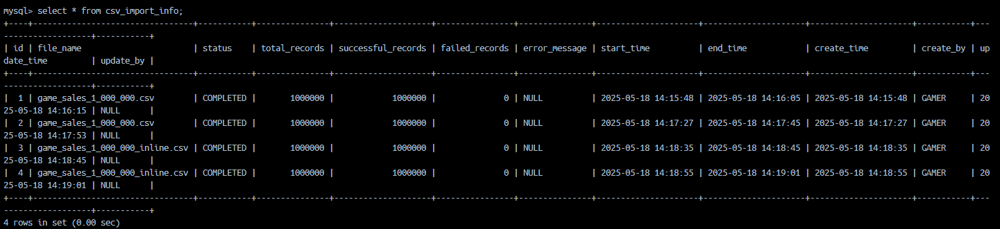
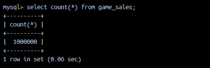
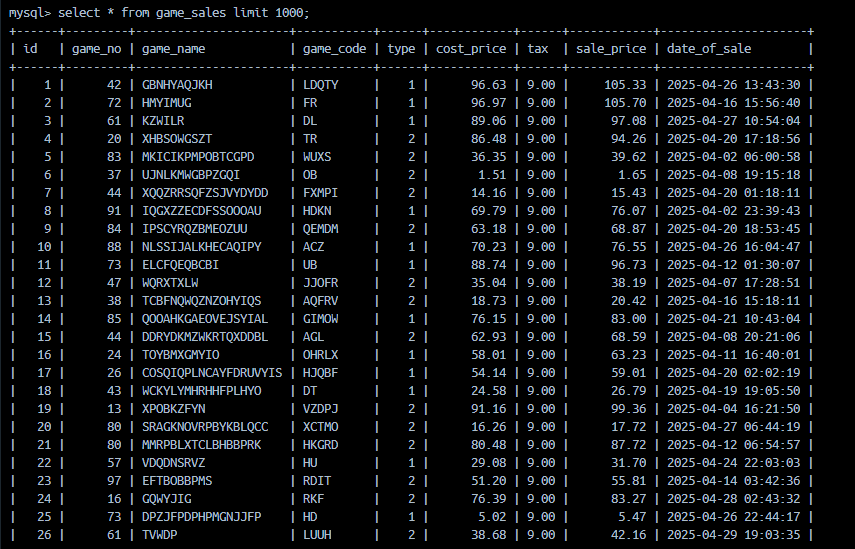
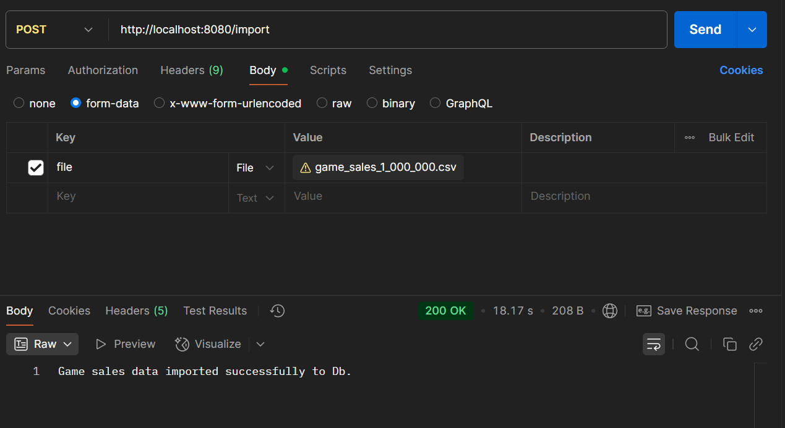
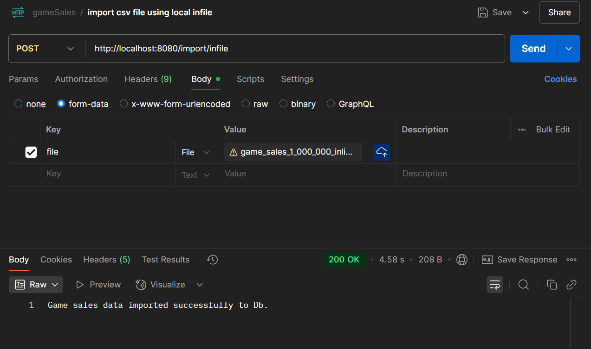
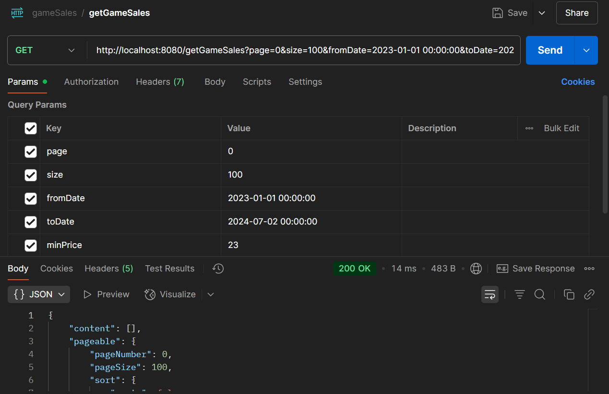
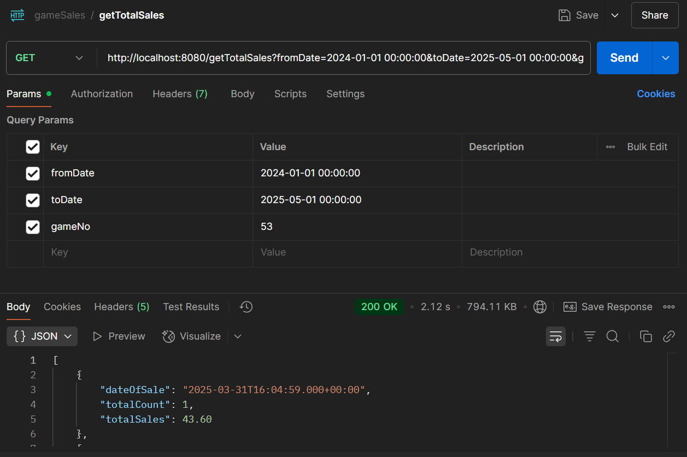

# Game Sales API

This project implements the tasks from the **Backend Engineer Coding Test** using the **Java Spring Boot** framework and **MySQL database**. It provides several endpoints to import, store and retrieve game sales data.

## Features

The project exposes the following RESTful API endpoints:

- **POST** `/import`: Imports data from a CSV file into the MySQL database with batch processing or using the `LOAD DATA LOCAL INFILE` feature (for Task 5).
- **GET** `/getGameSales`: Retrieves a list of game sales based on provided filters (date or sales price) with pagination support.
- **GET** `/getTotalSales`: Retrieves the total game sales based on provided filters (date or game number).

## Requirements

Ensure that the following are installed before you begin:

- **Java 17** or higher
- **Docker** with a MySQL server
- **Postman** (optional for testing API endpoints)

## Installation

To get the project up and running locally:

1. **Clone the repository**:

    ```bash
    git clone https://github.com/Tychicus2323/game-sales.git
    ```

2. **Navigate to the project directory**:

    ```bash
    cd game-sales
    ```

3. **Install dependencies and build the project**:

    ```bash
    mvn clean install
    ```

4. **Start MySQL Docker container** (if you haven't already):

    If you're using Docker to run MySQL, ensure you have a MySQL container running. You can start it using:

    ```bash
	docker pull mysql/mysql-server
    ```

    ```bash
	docker run --name mysql-game-sales -e MYSQL_ROOT_PASSWORD=password -e MYSQL_DATABASE=game_db -e MYSQL_USER=user1 -e MYSQL_PASSWORD=password1 -p 3306:3306 -d mysql/mysql-server --local-infile=1
    ```
	
	```bash
	docker exec -it mysql-game-sales mysql -u root -p
	```

5. **Run the application**:

    After building the project, you can run it locally using:

    ```bash
    mvn spring-boot:run
    ```

6. **Test the API**:

    Optionally, use **Postman** or any other API testing tool to test the endpoints:
    
    - **POST** `/import` - Upload a CSV file to import game sales data.
    - **GET** `/getGameSales` - Retrieve paginated game sales based on filters.
    - **GET** `/getTotalSales` - Retrieve total sales based on filters.

## Usage

### Import Game Sales Data

You can import game sales data by sending a CSV file to the `/import` endpoints. Example using **Postman**:

- **POST** `/import`
- **Content-Type:** `multipart/form-data`
- **Headers:**
  - `useInFile` (optional, boolean):  
    Set to `true` to enable [`LOAD DATA LOCAL INFILE`](https://dev.mysql.com/doc/refman/8.0/en/load-data.html) for faster data insertion.  
    Defaults to `false` if not provided.

### Body Parameters

- `file` (required):  
  The CSV file to upload. Must be included as a `multipart/form-data` field named `file`.

### Retrieve Game Sales

- **GET** `/getGameSales`
    - Provides a list of game sales based on optional filters such as **datetime** and **sales price**.
    - Supports **pagination**.

    Example request:
    ```bash
    GET http://localhost:8080/getGameSales?page=0&size=100&fromDate=2023-01-01 00:00:00&toDate=2024-07-02 00:00:00&minPrice=23&maxPrice=10.0
    ```

### Retrieve Total Game Sales

- **GET** `/getTotalSales`
    - Retrieves the total sales for games based on filters such as **datetime** or **game number**.

    Example request:
    ```bash
    GET http://localhost:8080/getTotalSales?fromDate=2023-01-01 00:00:00&toDate=2025-07-02 00:00:00
    ```

## License

This project is licensed under the MIT License – see the [LICENSE.md](LICENSE.md) file for details.

## Screenshots

Here are some screenshots I have taken for the testing:

- **CSV Import Info**:
    
    - This screenshot shows the progress of the CSV import process and information.

- **Game Sales DB Count**:
    
    - This screenshot shows the **MySQL database count** after inserting 1 million records, demonstrating the scale of data being handled.

- **Game Sales DB Records**:
    
    - This screenshot displays the **game sales records** inside the MySQL database after the import operation.

- **Postman Time Taken for 1 Million Records Using Batch**:
    
    - This screenshot shows the **Postman response** time taken for importing 1 million records using batch processing.

- **Postman Time Taken for 1 Million Records Using Local Infile**:
    
    - This screenshot shows the **Postman response** time taken for importing 1 million records using the `LOAD DATA LOCAL INFILE` feature.

- **Postman – Get Game Sales Endpoint**  
    
	- This screenshot shows the response from the `/getGameSales` endpoint, which retrieves a paginated list of game sales records based on optional filters like date range and price range.

- **Postman – Get Total Sales Endpoint**  
    
     - This screenshot demonstrates the `/getTotalSales` endpoint, which calculates the total sales amount for a specified date range or specific game number.

## Postman Collection

You can import the following **Postman collection** to test the API endpoints:

- Download the collection file: [game-sales-postman-collection.json](./postman/game-sales-postman-collection.json)
- To import the collection in Postman:
  1. Open Postman.
  2. Go to **File > Import**.
  3. Select the **game-sales-postman-collection.json** file.
  4. Click **Import**.


## Acknowledgements

- This project was developed by **Vincent Tay** for the **Backend Engineer Coding Test**. 
- Acknowledgements to the **Spring Boot** and **MySQL** communities for their excellent documentation and support.
- Thanks to the **Postman** tool for making it easier to test and debug the API endpoints during development.